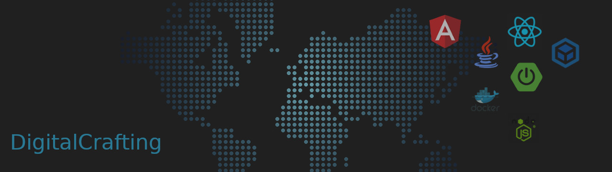

### Hi there 👋

### I'm DigitalCrafting
- 🔭 I’m currently working on [eregold project](https://github.com/DigitalCrafting/eregold)
- 🌱 I’m currently learning React and planning on learning React Native
- ⚡ Fun fact: I'm also learning Japanese

### 🔧 Tools & Technologies:

#### Backend:

#### Frontend:

#### Databases:

#### Cloud

#### Other languages (in my free time):

<!--  -->

#### Contenerization:

#### Repositiories:

#### System:

<!-- 

 -->

### You can reach me at:

### I'm also writing articles at: 

<!--
**DigitalCrafting/DigitalCrafting** is a ✨ _special_ ✨ repository because its `README.md` (this file) appears on your GitHub profile.

Here are some ideas to get you started:

- 🔭 I’m currently working on ...
- 🌱 I’m currently learning ...
- 👯 I’m looking to collaborate on ...
- 🤔 I’m looking for help with ...
- 💬 Ask me about ...
- 📫 How to reach me: ...
- 😄 Pronouns: ...
- ⚡ Fun fact: ...
-->
